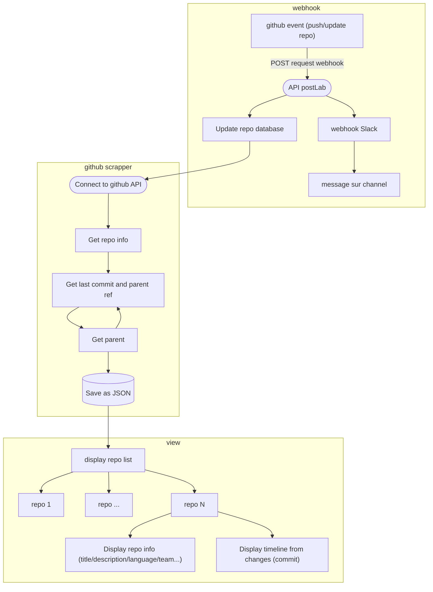

# Outil de veille et d’extraction d’information à partir de dépôts de code tels que Github, GitLab ou Bitbucket.

---

# Description des fichiers

| folder              |   file   |                                                       description |
| ------------------- | :------: | ----------------------------------------------------------------: |
| /                   | index.js |                                  launch github scrapper on a repo |
| /                   | Repo.js  |                          scrapper (get repo info and all commits) |
| /repo               |    *     |                    repository info and commits are stored as json |
| /documenation       |    *     |                                       documentation about project |
| /web                |    *     |                                        visualisation of json file |
| /webhook/functions/ | index.js | format incomming webhook from github and send it to slack webhook |

---
# solution retenue

## 1 - réalisation vieille
- webhook (dépots adhérent postlab)
- cron (autre dépot)
## 2 - extraction des données
- api github
- info repo & commit stoqués en json
## 3 -  visualisation

