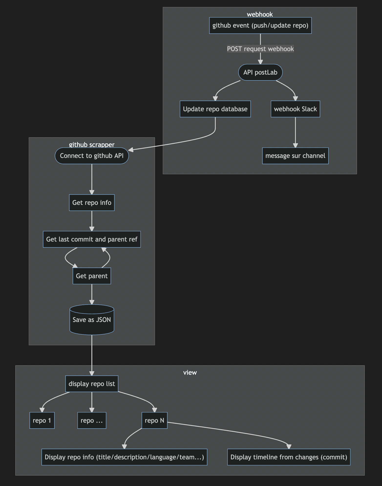
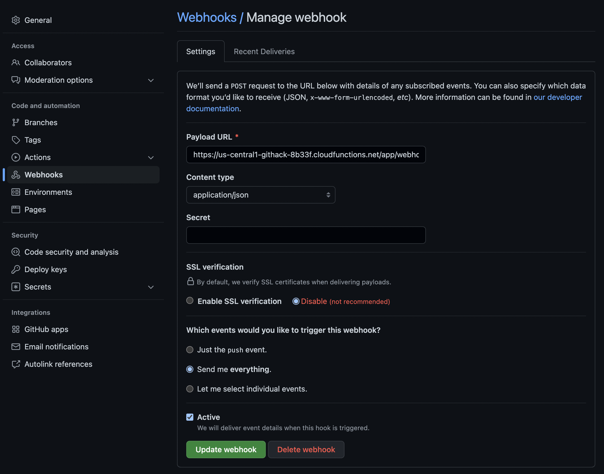
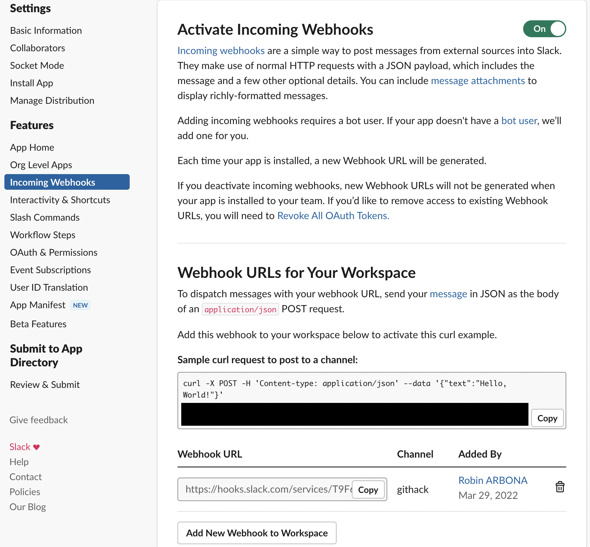

# Outil de veille et d’extraction d’information à partir de dépôts de code tels que Github, GitLab ou Bitbucket.

---

# solution retenue

## 1 - réalisation vieille
- webhook (dépots adhérent postlab)
- cron (autre dépot) (non réalisé)
## 2 - extraction des données
- api github
- info repo & commit stoqués en json
## 3 -  visualisation

---

# proof of concept

[Repo github](https://github.com/robin-arbona/postlab)

[slack](slack://open)

[Demo web](http://127.0.0.1:5500/web/index.html)

---

# Annexe webhook (1/2)

1 - Settings > webhooks > create

Add url (payload and request can be visualised in recent deliveries)

---

# Annexe webhook slack (2/2)

[Doc slack webhooks](https://api.slack.com/messaging/webhooks#posting_with_webhooks)

